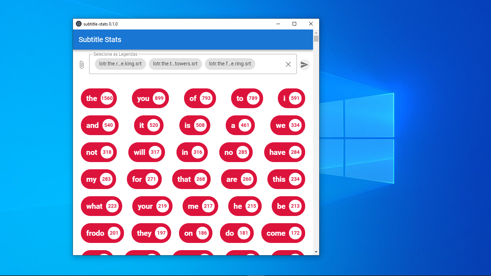

<h1 align="center"> 🎞 Subtitle Stats</h1>

<p>
    Desktop app that shows the most used words in a movie/serie subtitle in a .srt file format
</p>

<div align="center">
    
</div>

## Project setup
```
yarn install
```

### Compiles and hot-reloads for development
```
yarn serve
```

### Compiles and minifies for production
```
yarn build
```

### Lints and fixes files
```
yarn lint
```

### Customize configuration
See [Configuration Reference](https://cli.vuejs.org/config/).
